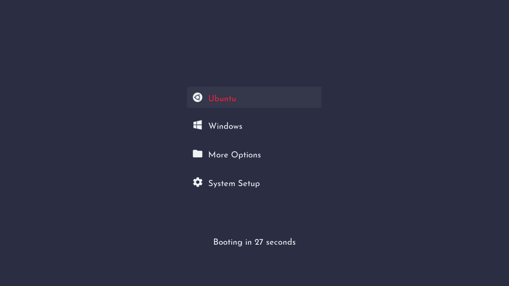
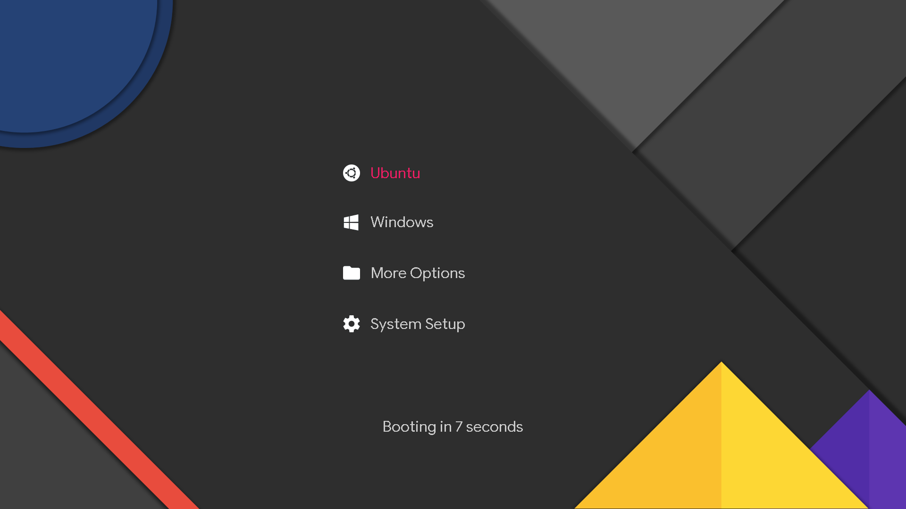

# Matter

Minimalist grub theme originally inspired by material design 2.


Feel free to open issues for any problem or request you have and/or submit pull
requests.

# Index

- [Matter](#matter)
- **[Download](#download)**
- [Usage](#usage)
  - [Help](#help)
  - **[Quick Start](#quick-start)**
  - [Uninstall](#uninstall)
  - [Fonts](#fonts)
  - [Colors](#colors)
  - [Images](#images-unfinished)
  - [Testing Without Rebooting](#testing-without-rebooting)
- [What does Matter do to my system
  files?](#what-does-matter-do-to-my-system-files)
- [Gallery](#gallery): [1](#example-1), [2](#example-2), [3](#example-3),
  [4](#example-4), [5](#example-5), [6](#example-6), [7](#example-7),
  [8](#example-8), [9](#example-9), [10](#example-10), [11](#example-11)
- [Contributing](#contributing)
- [Thanks](#thanks)

# Download

[Click here to download Matter](https://github.com/mateosss/matter/releases/latest/download/matter.zip)

It is **strongly advised** to put the downloaded files in some folder that will
not get deleted, as the main script `matter.py` is needed for future grub
updates made by your system. Also if you want to uninstall matter you could do
it from there as well.

## Dependencies

Matter will inform you of any missing dependencies, but here is a list anyways:

- `inkscape` (**Main dependency**): This brings the `convert` command from
  `imagemagick` with best svg to png conversion.
- `grub-mkconfig` and `grub-mkfont`: General grub utilities needed, if you
  don't have these, please create an issue with more information about your
  system as I've only worked with ones that have these commands.
- [`grub2-theme-preview`](https://github.com/hartwork/grub2-theme-preview)
  (Optional): For testing results (`--test/-t` argument) without rebooting.

# Usage

## Help

You always can see the command reference with `./matter.py -h`, next up are some
sections that may be useful, or may not be very well documented in the command's
help.

## Quick Start

<details>

<summary>Note for Fedora users (click to show)</summary>

*Matter does not yet support [The Boot Loader
Specification](https://systemd.io/BOOT_LOADER_SPECIFICATION/) so before executing
`matter.py` you should set `GRUB_ENABLE_BLSCFG="false"` in `/etc/default/grub` and then
update your grub file with `sudo grub2-mkconfig -o /boot/grub2/grub.cfg`*

*See [this issue](https://github.com/mateosss/matter/issues/41) for updates
or if you want to help out with fedora support*

</details>

Following is a Matter installation with default values. Don't worry, it is very
easy to rollback or overwrite this installation later if you wan't to.

The script that does all the work is `matter.py`, so let's start by running it

```sh
./matter.py
```

It outputs almost everything you need to know for later, but for now let's focus
on the list it shows, those are your grub entries. It should look similar to
this one:

```sh
1. Ubuntu
2. Windows
3. More Options
4. Ubuntu, with Linux 5.3.0-61-generic
5. Ubuntu, with Linux 5.3.0-61-generic (recovery mode)
6. Ubuntu, with Linux 5.3.0-59-generic
7. Ubuntu, with Linux 5.3.0-59-generic (recovery mode)
8. System Setup
```

Now you should pick some icons from <https://materialdesignicons.com> for each entry
listed, (you only need the icon's name, use the search panel and hover over any
icon you like to see its name). In these example I will pick `ubuntu` for entry
1, `microsoft-windows` for 2, `folder` for 3 (as it is a submenu in my
particular case), and `cog` for 8, I don't care about all the remaining entries
so I will just use "`_`" (underscore) for those.

```sh
# Installs matter with icons matching the corresponding entries
./matter.py -i ubuntu microsoft-windows folder _ _ _ _ cog
```

**And thats it!** If you reboot now, you should get something like this:



*Tip: If you need to tidy up your grub entries hierarchy and names I recommend
using [grub-customizer](https://launchpad.net/grub-customizer)
([tutorial](https://vitux.com/how-to-install-grub-customizer-on-ubuntu/))*.

## Uninstall

You can completely remove Matter from your system with `./matter.py -u`

## Fonts

Matter uses `.ttf` fonts and only one, the default, comes prepackaged. You can
specify your own fonts by giving a `.ttf` file, the font name, and an optional
font size like so:

```sh
./matter.py -ff ~/fonts/Cinzel/Cinzel-Regular.ttf -fn Cinzel Regular -fs 40
```

- `--fontfile/-ff`: The `.ttf` path
- `--fontname/-fn`: The name of the font, in this case `Cinzel Regular` but
  could be `Open Sans Bold` (*Tip: If you don't know the font name, you can
  specify any name, go to the grub, press C to open console, and type `lsfonts`
  to list the font names*)
- `--fontsize/-fs`: By default it is 32, recommended values are multiples of 4.
- `--font/-f`: This argument is not used in this example as it is used to select
  prepackaged fonts. Note that after giving a ttf file to `-ff`, matter will
  save it as a prepackaged font, so it could be referenced later on with this
  flag. See prepackaged (available) fonts at the end of `--help/-h` output

*Tip: [Google Fonts](https://fonts.google.com/) is a good place to get fonts*

## Colors

You can specify the color of 4 elements: `--foreground/-fg`, `--background/-bg`,
`--iconcolor/-ic` and `--highlight/-hl` (selected text color), there are some
Material Design colors prepackaged that you can see at the end of the
`--help/-h` output, you can also specify custom colors. Here is an example of
the syntax:

```sh
./matter.py -hl FFC107 -fg white -bg 2196f3 -ic pink
```

## Images (unfinished)

You can specify a background image with `--image/-im`, the supported image
formats/extensions are PNG, JPG, JPEG, and TGA. This feature is considered
*unfinished* because it does not yet work as well as it could *(see
[#58](https://github.com/mateosss/matter/issues/58))*

Here is an example of the syntax:

```sh
./matter.py -im ~/Pictures/some-cool-image-that-has-good-contrast-with-my-text-color.png
```

## Testing Without Rebooting

If you install the `pip` package
[`grub2-theme-preview`](https://github.com/hartwork/grub2-theme-preview) you can
test combinations of fonts and colors with the `--buildonly/-b` and `--test/-t`
flags like so:

```sh
./matter.py -t -b -i ubuntu microsoft-windows folder _ _ _ _ _ _ cog \
-hl FFC107 -fg white -bg 2196F3 \
-ff ~/fonts/MuseoModerno/static/MuseoModerno-Regular.ttf \
-fn MuseoModerno Regular -fs 40
```

*Note: it will use your system's grub.cfg, so set your icons beforehand*.

# What does Matter do to my system files?

Besides the need for the extracted files to be in a persistent location, Matter
needs to edit three files:

1. `/etc/default/grub`: For setting theme and resolution.
2. `/boot/grub/grub.cfg`: For setting icons.
3. `/usr/sbin/grub-mkconfig`: For making icons persistent across grub updates.
4. `/etc/grub.d/99_matter`: For making icons persistent across grub upgrades.

Also it places the theme files in `/boot/grub/themes/Matter/`, this one is
standard to grub themes in general.

Both **(1)** and **(3)** are clearly distinguished with special `BEGIN`/`END`
comments at the end of each file. **(2)** Adds a `--class` flag to each entry,
but it can be restored as new with `update-grub`. And **(4)** is a custom file.

*All of these modifications are **completely** cleaned up by uninstalling*

# Gallery

Here are some examples with their respective commands that you can copy or get
inspired from.

## Example 1


*Font: [Josefin Sans Regular
400](https://fonts.google.com/specimen/Josefin+Sans)*

```sh
# Light version, invert -fg and -bg for dark one
./matter.py -i ubuntu microsoft-windows folder _ _ _ _ _ _ cog \
-hl ef233c -fg 2b2d42 -bg edf2f4 \
-ff ~/fonts/Josefin_Sans/static/JosefinSans-Regular.ttf \
-fn Josefin Sans Regular -fs 32
```

## Example 2


*Font: [Comfortaa Medium 500](https://fonts.google.com/specimen/Comfortaa)*

```sh
./matter.py -i ubuntu microsoft-windows folder _ _ _ _ _ _ cog \
-hl white -fg f0f0f0 -bg ff0d7b \
-ff ~/fonts/Comfortaa/static/Comfortaa-Medium.ttf \
-fn Comfortaa Regular -fs 32
```

## Example 3


*Font: [Lobster Regular 400](https://fonts.google.com/specimen/Lobster)*

```sh
./matter.py -i ubuntu microsoft-windows folder _ _ _ _ _ _ cog \
-hl 118ab2 -fg ffd166 -bg 073b4c \
-ff ~/fonts/Lobster/Lobster-Regular.ttf \
-fn Lobster Regular -fs 32
```

## Example 4


*Fonts: [Bebas Neue Regular 400](https://fonts.google.com/specimen/Bebas+Neue)
and [Russo One Regular 400](https://fonts.google.com/specimen/Russo+One)*

```sh
# Using Bebas Neue font (more compact), the other uses Russo One
./matter.py -i ubuntu microsoft-windows folder _ _ _ _ _ _ cog \
-hl 2c251b -fg 2c251b -bg ffe70b \
-ff ~/fonts/Bebas_Neue/BebasNeue-Regular.ttf \
-fn Bebas Neue Regular -fs 36
# -ff ~/fonts/Russo_One/RussoOne-Regular.ttf \
# -fn Russo One Regular -fs 36

```

## Example 5


*Font: [Poiret One Regular 400](https://fonts.google.com/specimen/Poiret+One)*

```sh
./matter.py -i ubuntu microsoft-windows folder _ _ _ _ _ _ cog \
-hl black -fg 101010 -bg fce1e0 \
-ff ~/fonts/Poiret_One/PoiretOne-Regular.ttf \
-fn Poiret One Regular -fs 48
```

## Example 6


*Font: [Josefin Sans Medium
500](https://fonts.google.com/specimen/Josefin+Sans)*

```sh
./matter.py -i ubuntu microsoft-windows folder _ _ _ _ _ _ cog \
-hl ffe78a -fg fdf7f9 -bg 582335 \
-ff ~/fonts/Josefin_Sans/static/JosefinSans-Medium.ttf \
-fn Josefin Sans Regular -fs 32
```

## Example 7


*Font: [Josefin Slab Bold 700](https://fonts.google.com/specimen/Josefin+Slab)*

```sh
./matter.py -i ubuntu microsoft-windows folder _ _ _ _ _ _ cog \
-hl A4E11E -fg white -bg 5b1ee1 \
-ff ~/fonts/Josefin_Slab/JosefinSlab-Bold.ttf \
-fn Josefin Slab Bold -fs 36
```

## Example 8


*Font: [MuseoModerno Regular
400](https://fonts.google.com/specimen/MuseoModerno)*

```sh
./matter.py -i ubuntu microsoft-windows folder _ _ _ _ _ _ cog \
-hl FFC107 -fg white -bg 2196F3 \
-ff ~/fonts/MuseoModerno/static/MuseoModerno-Regular.ttf \
-fn MuseoModerno Regular -fs 32
```

## Example 9


*Font: [Amatic SC Regular 400](https://fonts.google.com/specimen/Amatic+SC)*

```sh
./matter.py -i ubuntu microsoft-windows folder _ _ _ _ _ _ cog \
-bg FFF8E1 -fg 263238 -hl E91E63 \
-ff ~/fonts/Amatic_SC/AmaticSC-Regular.ttf \
-fn Amatic SC Regular -fs 64
```

## Example 10


*Font: [Cinzel Regular 400](https://fonts.google.com/specimen/Cinzel)*

```sh
# This is the light version, the dark one uses -bg 1a1d21 -fg c9a45b instead
./matter.py -i ubuntu microsoft-windows folder _ _ _ _ _ _ cog \
-hl c28f2c -bg white -fg d0a85c \
-ff ~/fonts/Cinzel/Cinzel-Regular.ttf \
-fn Cinzel Regular -fs 40
# -hl c28f2c -bg 1a1d21 -fg c9a45b \
```

## Example 11



```sh
./matter.py -i ubuntu microsoft-windows folder _ _ _ _ _ _ cog \
-im ~/images/material-background.png
```

# Contributing

Feel free to submit any pull request that improves in any way the project.

Read the wiki <https://github.com/mateosss/matter/wiki>, that's where any useful
information for developers will reside.

If you think you got a nice result out of Matter and would like to share it,
please create an issue with it! I would love to see your results.

# Thanks

- Original theme based on <https://github.com/vinceliuice/grub2-themes>
- Icons from <https://materialdesignicons.com/>
- Fonts mainly from <https://fonts.google.com>
